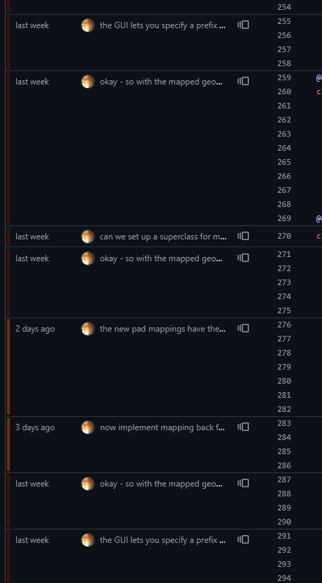

Clautribution
==============


Clautribution is a Claude Code plugin to make it clearer what human thought and effort went into a program. The plugin tries to capture the intent behind the code into the Git commit message sidechanel, embedding the prompts and context that begot code into the Git history.

# The problem

Hand-written code is there because of human intent: somebody had to sit down and write it out intentionally, and when reading it you can try and recover the original thought process. In flowchart form, the process looks sort of like

```
Original Developer ---> Code ---> You
```

In contrast, agentic software development puts the agent between the originating human and the code, reducing the value of the code as a mechanism to illuminate the original thought process. There's a "bubble" formed that contains the LLM and the developer that is isolated from the ultimate code; the thought is first laundered by the LLM before it is then reified into the software. A visualization is

```
Original Developer ---> LLM ---> Code ---> You
```

From the perspective of the code reviewer, it's impossible to tell what was human intent or a product of the LLM. It's all jumbled together. Even with attribution (e.g. "with Claude" commits) that just tells you that some of that commit was human made and some was LLM-generated: it doesn't tell you what the human did or what the model did, just that there was some amount of model involved.

Personally, I find LLM-generated code very alienating. It's always in question what was written by a human or what was written by the model. This then makes it hard to give effective feedback or even understand where the original contributor was coming from, since all of that is lost in a wash of code with a comment every four lines with a perfectly grammatical sentence. The idea behind Clautribution is that by making a clear distinction between:

* Human-written code, which is committed standalone,
* The prompts that were given to the model, which become commit messages, and
* The LLM-generated code

it becomes easier to understand where the model stops and where the person who was responsible for it begins. 

# How it works

In short, Clautribution tracks the conversation between Claude and the user and converts it into commit messages along with the context that the model used on the way there. Every time that Claude finishes after having written code - that is, stops running and returns execution back to the user - Clautribution will make a commit with all of the prompts that Claude was given since the last time code was generated. This produces *a lot* of extremely verbose commits, for obvious reasons, so I suggest working on a feature branch.

In more technical terms, Clautribution accumulates all of the prompts given in unproductive turns and saves all of that into the next productive turn. A turn is an exchange between the user and the model from prompt to ready-for-next-prompt, and a productive turn is an exchange that generated code. For the most part it's fully automatic: as soon as you load the plugin it'll start working. 

Clautribution provides two skills or slash commands:
* `/drop`, which drops the unproductive context prior to the invocation if you don't want it to be included in the commit, and
* `/preview` which previews the commit message that will be made once a productive turn happens.

By design, every productive turn always includes the conversation history that immediately led up to the code changes; `/drop` can only be used to get rid of unproductive turns that shouldn't be included in the message. If you want to get rid of history entirely, use `/rewind` (which is supported by Clautribution and will rewind Git along with it).

# What it looks like

The goal of Clautribution is to provide fine-grained attribution from thought to code through the window of `git blame`.



A repository developed with clautribution precisely attributes what code came from what thought, making it clearer what the thought process was that led to the realized program.

# How to install it

Clautribution is available currently as a plugin zip file. Download the build that's applicable for your architecture from [the releases page](https://github.com/BenChung/Clautribution/releases) and then unzip it to a directory. Then in Claude Code run
```
/plugin marketplace add ./clautribution
/plugin install clautribution@clautribution-marketplace
```
